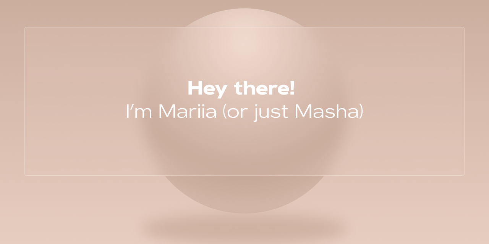

## About me ✍️

Hi, I’m Mariia (Masha) — a frontend developer currently based in the USA.

I’m mostly self-taught; even though I’m a bootcamp graduate, the majority of what I know, I’ve learned on my own.

I have a background in graphic design, which explains my obsession with dopamine-inducing interfaces. I love exploring new ways to create, build, and solve meaningful problems.

## Connect with me in LinkedIn:

